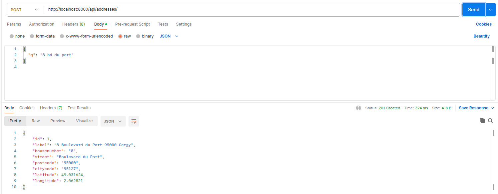
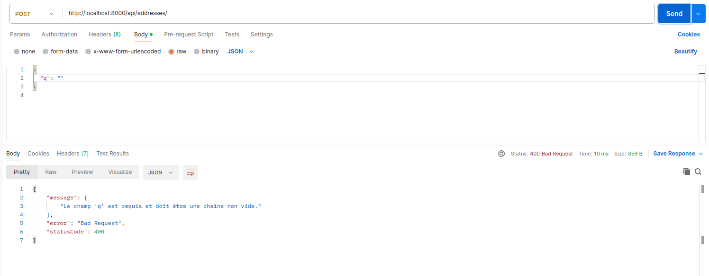
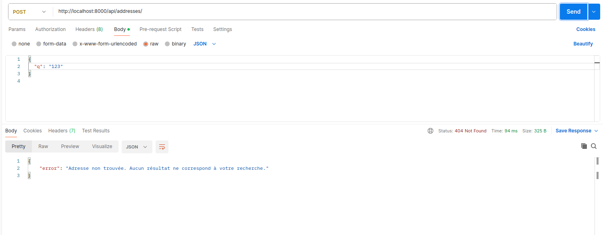
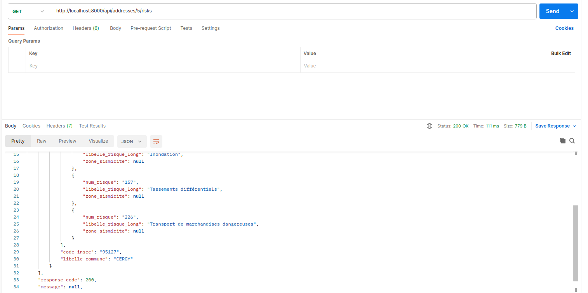

# Adresse API Dockerisée

Cette API permet d'enregistrer des adresses et de consulter les risques associés à chaque adresse en utilisant les API externes **BAN** et **Géorisques**. Elle est construite avec **NestJS** et une base de données **SQLite**.

## Prérequis

Avant de commencer, assurez-vous d'avoir installé Docker et Docker Compose sur votre machine.

## Démarrer le projet avec Docker

### 1. Cloner le projet

```bash
git clone https://github.com/sybarry/adresse-api.git
cd adresse-api
cd src
```

### 2. Construire et lancer le projet

```bash
docker-compose build
docker-compose up
```
Reconstruis proprement ton conteneur Docker (si besoin)
```bash
docker-compose down --volumes --remove-orphans
docker-compose build --no-cache
docker-compose up --force-recreate

```

### 3. Accéder à l'API

Une fois que les conteneurs sont lancés, l'API sera accessible sur `http://localhost:8000`.

## Variables d'environnement

### NestJS

```bash
TYPEORM_CONNECTION=sqlite
TYPEORM_DATABASE=/data/db.sqlite
```

### Explication des variables

- `TYPEORM_CONNECTION=sqlite` : Utilise SQLite pour la base de données.
- `TYPEORM_DATABASE=/data/db.sqlite` : Emplacement de la base de données SQLite dans le volume Docker.

## Endpoints API

### 1. `POST /api/addresses/`

Permet d'enregistrer une adresse en fonction de la chaîne de recherche donnée.

#### Payload

```json
{
  "q": "chaîne de recherche d'adresse"
}
```

#### Réponse attendue

- **200 OK**

```json
{
  "id": 1,
  "label": "8 bd du Port, 56170 Sarzeau",
  "housenumber": "8",
  "street": "bd du Port",
  "postcode": "56170",
  "citycode": "56242",
  "latitude": 47.58234,
  "longitude": -2.73745
}
```



- **400 Bad Request**

```json
{
  "error": "Le champ 'q' est requis et doit être une chaîne non vide."
}
```



- **404 Not Found**

```json
{
  "error": "Adresse non trouvée. Aucun résultat ne correspond à votre recherche."
}
```




- **500 Internal Server Error**

```json
{
  "error": "Erreur serveur : impossible de contacter l'API externe."
}
```

#### Exemple de requête avec `curl`

```bash
curl -X POST http://localhost:8000/api/addresses/   
   -H "Content-Type: application/json"   
   -d '{"q": "8 bd du port"}'
```

### 2. `GET /api/addresses/{id}/risks`

Permet de consulter les risques associés à l'adresse identifiée par `id`.

#### Paramètre

- `id` : ID de l'adresse dans la base de données.

#### Réponse attendue

- **200 OK**

```json
{
  "riskData": { ... }  // Le JSON complet retourné par l'API Géorisques
}
```



- **404 Not Found**

```json
{
  "error": "Adresse non trouvée."
}
```


- **500 Internal Server Error**

```json
{
  "error": "Erreur serveur : échec de la récupération des données de Géorisques."
}
```


#### Exemple de requête avec `curl`

```bash
curl http://localhost:8000/api/addresses/1/risks
```

## Tests

Les tests unitaires sont configurés avec Jest. Vous pouvez les exécuter en utilisant la commande suivante :

```bash
docker-compose exec app npm run test
```

## Structure des dossiers

Voici la structure des dossiers du projet :

```
.
├── src
│   ├── addresses
│   │   ├── addresses.controller.ts
│   │   ├── addresses.service.ts
│   │   ├── address.entity.ts
│   │   └── dto
│   │       └── create-address.dto.ts
├── test
│   └── addresses.service.spec.ts
├── docker-compose.yml
├── Dockerfile
├── package.json
└── README.md
```

## Docker & Orchestration

Le projet utilise Docker Compose pour simplifier le déploiement. Il y a un seul conteneur qui expose le port `8000`. La base de données SQLite est persistée dans un volume Docker.


## Dépôt Git

Le projet est hébergé sur un dépôt Git public. Assurez-vous que les instructions de démarrage fonctionnent dès le clonage du projet.

## À propos

Ce projet est réalisé dans le cadre d'une démonstration d'API Dockerisée avec NestJS. L'API permet d'interagir avec deux services externes : **API BAN** et **Géorisques**, et stocke les données des adresses dans une base SQLite.
